 
======================================================================

MONTE CARLO SIMULATION WITH CONNECTION ANALYSIS

======================================================================

Recommended configurations:
  - Standard: 10000 users, 10 rounds, 20 simulations (2M events)
  - More rounds: 10000 users, 100 rounds, 20 simulations (20M events)
  - More users: 25000 users, 50 rounds, 20 simulations (25M events)
  - Maximum: 25000 users, 100 rounds, 20 simulations (50M events)

Enter number of users per simulation (e.g., 10000, 25000): 22
Enter number of rounds per simulation (e.g., 10, 50, 100): 10
Enter number of simulations to run (e.g., 20): 100

======================================================================

Configuration:
  - Users per simulation: 22
  - Rounds per simulation: 10
  - Total simulations: 100
  - Total matching events: 22,000
  - Expected mixed pairs: ~8
 
======================================================================

Running 100 simulations with 22 users...
  Completed 5/100 simulations...
  Completed 10/100 simulations...
  Completed 15/100 simulations...
  Completed 20/100 simulations...
  Completed 25/100 simulations...
  Completed 30/100 simulations...
  Completed 35/100 simulations...
  Completed 40/100 simulations...
  Completed 45/100 simulations...
  Completed 50/100 simulations...
  Completed 55/100 simulations...
  Completed 60/100 simulations...
  Completed 65/100 simulations...
  Completed 70/100 simulations...
  Completed 75/100 simulations...
  Completed 80/100 simulations...
  Completed 85/100 simulations...
  Completed 90/100 simulations...
  Completed 95/100 simulations...
  Completed 100/100 simulations...
Simulation complete! Found 3742 mixed pairs.

======================================================================

PART 1: MONTE CARLO STATISTICAL RESULTS

======================================================================

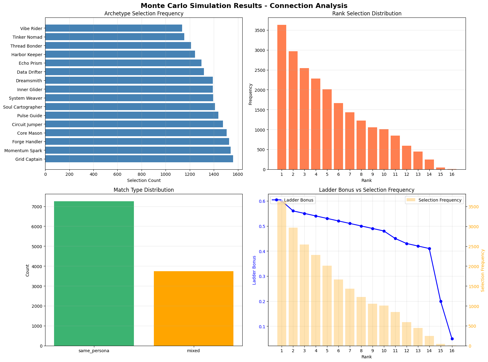

Simulation Parameters:
  - Users per simulation: 22
  - Rounds per simulation: 10
  - Total simulations: 100
  - Total matching events: 22,000
  - Mixed pairs found: 3,742

Top 5 Most Selected Archetypes:
  Grid Captain        :   1560 selections (7.1%)
  Momentum Spark      :   1539 selections (7.0%)
  Forge Handler       :   1526 selections (6.9%)
  Core Mason          :   1507 selections (6.9%)
  Circuit Jumper      :   1477 selections (6.7%)

Rank Selection Distribution:
  Rank 1-3:   9139 (41.5%)
  Rank 4-8:   8617 (39.2%)
  Rank 9-16:   4244 (19.3%)

Match Type Distribution:
  same_persona        :   7258 (66.0%)
  mixed               :   3742 (34.0%)

======================================================================

PART 2: CURATED SYNERGY EXAMPLE

======================================================================

Searching for high-synergy pair...
Found synergy pair (synergy score: 2294.576)
  Person A: Top archetype = Core Mason
  Person B: Top archetype = Pulse Guide

Asymmetric Pathways Found:
  N/A | N/A: Gap A→B=0.023, Gap B→A=-0.023, Diagnostic=Direct Asymmetry
  N/A | N/A: Gap A→B=-0.101, Gap B→A=0.101, Diagnostic=Direct Asymmetry
  N/A | N/A: Gap A→B=-0.085, Gap B→A=0.085, Diagnostic=Direct Asymmetry
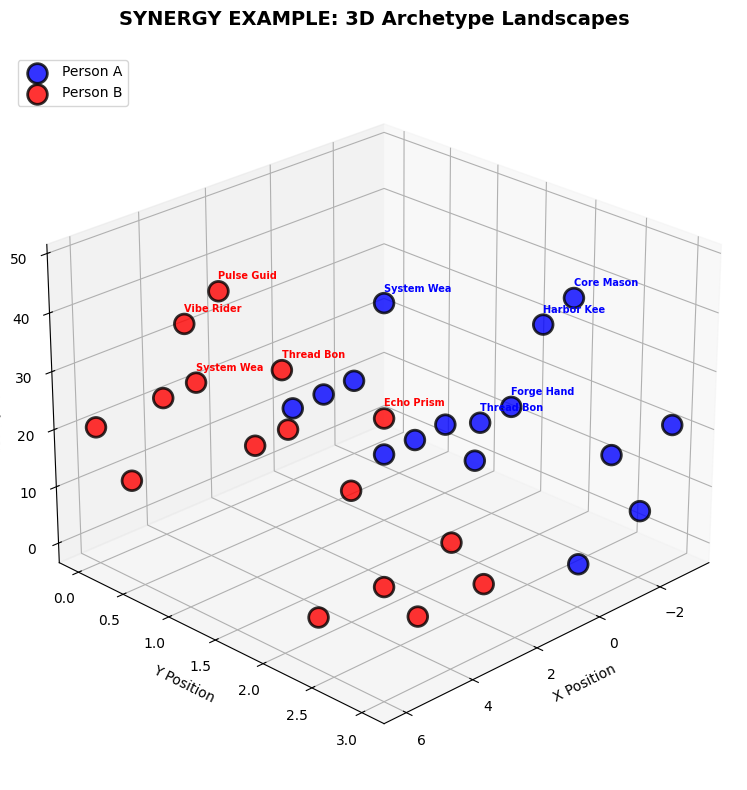

Note: This chart did not load correctly will fix later...

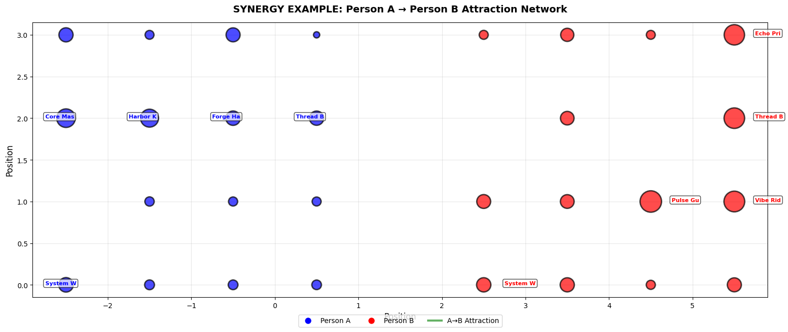
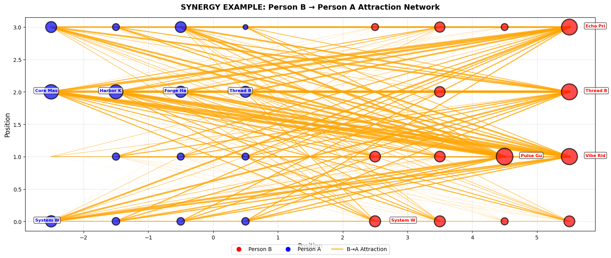
Top 5 A→B Attractions:
  Core Mason           → Pulse Guide          (strength: 0.456, reverse: 0.512)
  Core Mason           → Vibe Rider           (strength: 0.430, reverse: 0.470)
  Core Mason           → Thread Bonder        (strength: 0.424, reverse: 0.460)
  Harbor Keeper        → Pulse Guide          (strength: 0.421, reverse: 0.486)
  Core Mason           → Echo Prism           (strength: 0.418, reverse: 0.449)

Top 5 B→A Attractions:
  Pulse Guide          → Core Mason           (strength: 0.512, reverse: 0.456)
  Pulse Guide          → Harbor Keeper        (strength: 0.486, reverse: 0.421)
  Vibe Rider           → Core Mason           (strength: 0.470, reverse: 0.430)
  Thread Bonder        → Core Mason           (strength: 0.460, reverse: 0.424)
  Echo Prism           → Core Mason           (strength: 0.449, reverse: 0.418)

======================================================================

PART 3: AGGREGATE CONNECTION ANALYSIS (MIXED PAIRS)

======================================================================

Analyzing aggregate patterns from 100 mixed pairs...
  Average A→B connection strength: 0.080
  Average B→A connection strength: 0.082
  Average synergy score: 941.252
  Total asymmetric pathways found: 2270091
 
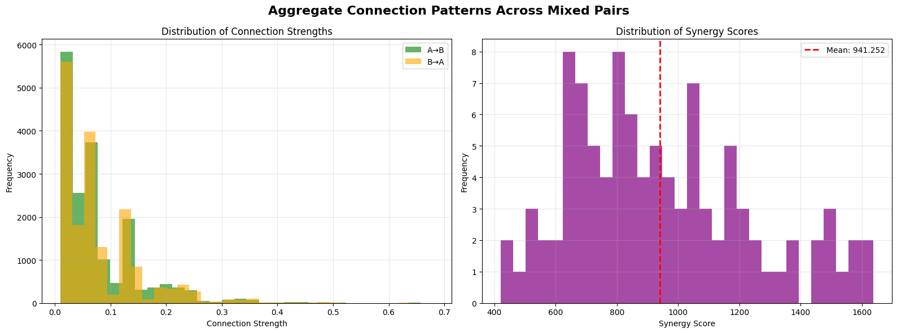

======================================================================

ANALYSIS COMPLETE!

======================================================================

 
======================================================================

MONTE CARLO SIMULATION WITH CONNECTION ANALYSIS

======================================================================

Recommended configurations:
  - Standard: 10000 users, 10 rounds, 20 simulations (2M events)
  - More rounds: 10000 users, 100 rounds, 20 simulations (20M events)
  - More users: 25000 users, 50 rounds, 20 simulations (25M events)
  - Maximum: 25000 users, 100 rounds, 20 simulations (50M events)

Enter number of users per simulation (e.g., 10000, 25000): 500
Enter number of rounds per simulation (e.g., 10, 50, 100): 10
Enter number of simulations to run (e.g., 20): 100

======================================================================

Configuration:
  - Users per simulation: 500
  - Rounds per simulation: 10
  - Total simulations: 100
  - Total matching events: 500,000
  - Expected mixed pairs: ~200
 
======================================================================

Running 100 simulations with 500 users...
  Completed 5/100 simulations...
  Completed 10/100 simulations...
  Completed 15/100 simulations...
  Completed 20/100 simulations...
  Completed 25/100 simulations...
  Completed 30/100 simulations...
  Completed 35/100 simulations...
  Completed 40/100 simulations...
  Completed 45/100 simulations...
  Completed 50/100 simulations...
  Completed 55/100 simulations...
  Completed 60/100 simulations...
  Completed 65/100 simulations...
  Completed 70/100 simulations...
  Completed 75/100 simulations...
  Completed 80/100 simulations...
  Completed 85/100 simulations...
  Completed 90/100 simulations...
  Completed 95/100 simulations...
  Completed 100/100 simulations...
Simulation complete! Found 4023 mixed pairs.

======================================================================

PART 1: MONTE CARLO STATISTICAL RESULTS

======================================================================
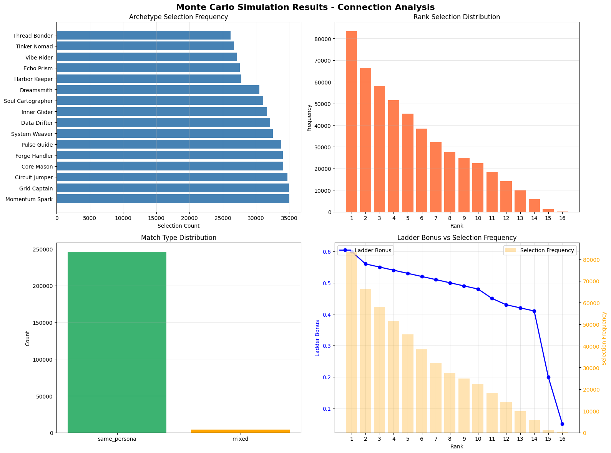

Simulation Parameters:
  - Users per simulation: 500
  - Rounds per simulation: 10
  - Total simulations: 100
  - Total matching events: 500,000
  - Mixed pairs found: 4,023

Top 5 Most Selected Archetypes:
  Momentum Spark      :  35012 selections (7.0%)
  Grid Captain        :  34972 selections (7.0%)
  Circuit Jumper      :  34744 selections (6.9%)
  Core Mason          :  34118 selections (6.8%)
  Forge Handler       :  34057 selections (6.8%)

Rank Selection Distribution:
  Rank 1-3: 207918 (41.6%)
  Rank 4-8: 195114 (39.0%)
  Rank 9-16:  96968 (19.4%)

Match Type Distribution:
  same_persona        : 245977 (98.4%)
  mixed               :   4023 (1.6%)

======================================================================

PART 2: CURATED SYNERGY EXAMPLE

======================================================================

Searching for high-synergy pair...
Found synergy pair (synergy score: 2131.505)
  Person A: Top archetype = Data Drifter
  Person B: Top archetype = Data Drifter

Asymmetric Pathways Found:
  N/A | N/A: Gap A→B=-0.102, Gap B→A=0.102, Diagnostic=Direct Asymmetry
  N/A | N/A: Gap A→B=0.022, Gap B→A=-0.022, Diagnostic=Direct Asymmetry
  N/A | N/A: Gap A→B=-0.037, Gap B→A=0.037, Diagnostic=Direct Asymmetry
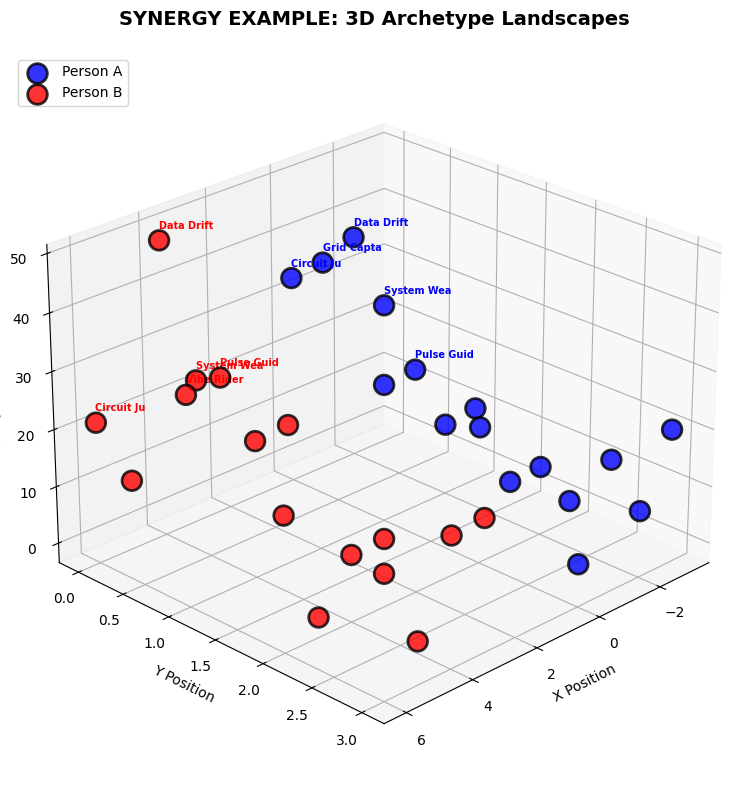

Note: This chart did not load correctly will fix later...

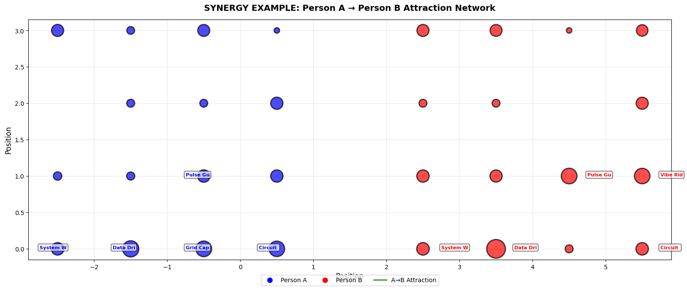
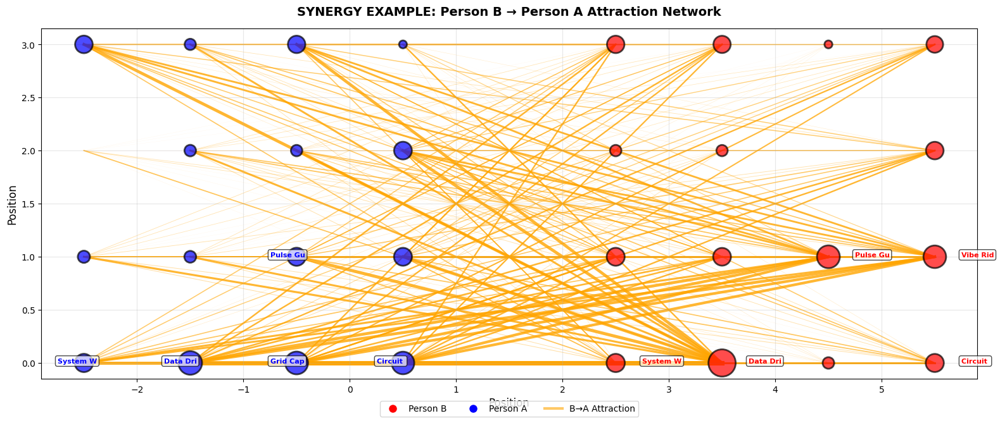

Top 5 A→B Attractions:
  Data Drifter         → Data Drifter         (strength: 0.456, reverse: 0.512)
  Grid Captain         → Data Drifter         (strength: 0.421, reverse: 0.486)
  Circuit Jumper       → Data Drifter         (strength: 0.413, reverse: 0.480)
  Data Drifter         → Pulse Guide          (strength: 0.341, reverse: 0.332)
  Data Drifter         → Vibe Rider           (strength: 0.336, reverse: 0.325)

Top 5 B→A Attractions:
  Data Drifter         → Data Drifter         (strength: 0.512, reverse: 0.456)
  Data Drifter         → Grid Captain         (strength: 0.486, reverse: 0.421)
  Data Drifter         → Circuit Jumper       (strength: 0.480, reverse: 0.413)
  Data Drifter         → System Weaver        (strength: 0.358, reverse: 0.256)
  Data Drifter         → Pulse Guide          (strength: 0.354, reverse: 0.251)

======================================================================

PART 3: AGGREGATE CONNECTION ANALYSIS (MIXED PAIRS)

======================================================================

Analyzing aggregate patterns from 100 mixed pairs...
  Average A→B connection strength: 0.079
  Average B→A connection strength: 0.077
  Average synergy score: 853.475
  Total asymmetric pathways found: 2126770
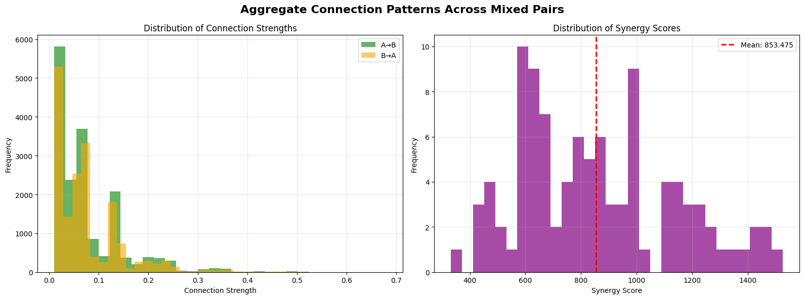

======================================================================

ANALYSIS COMPLETE!

======================================================================

 
======================================================================

MONTE CARLO SIMULATION WITH CONNECTION ANALYSIS

======================================================================

Recommended configurations:
  - Standard: 10000 users, 10 rounds, 20 simulations (2M events)
  - More rounds: 10000 users, 100 rounds, 20 simulations (20M events)
  - More users: 25000 users, 50 rounds, 20 simulations (25M events)
  - Maximum: 25000 users, 100 rounds, 20 simulations (50M events)

Enter number of users per simulation (e.g., 10000, 25000): 1000
Enter number of rounds per simulation (e.g., 10, 50, 100): 10
Enter number of simulations to run (e.g., 20): 10

======================================================================

Configuration:
  - Users per simulation: 1,000
  - Rounds per simulation: 10
  - Total simulations: 10
  - Total matching events: 100,000
  - Expected mixed pairs: ~40
 
======================================================================

Running 10 simulations with 1000 users...
  Completed 5/10 simulations...
  Completed 10/10 simulations...
Simulation complete! Found 384 mixed pairs.

======================================================================
PART 1: MONTE CARLO STATISTICAL RESULTS

======================================================================

Simulation Parameters:
  - Users per simulation: 1,000
  - Rounds per simulation: 10
  - Total simulations: 10
  - Total matching events: 100,000
  - Mixed pairs found: 384

Top 5 Most Selected Archetypes:
  Circuit Jumper      :   7054 selections (7.1%)
  Grid Captain        :   6997 selections (7.0%)
  Momentum Spark      :   6994 selections (7.0%)
  Core Mason          :   6834 selections (6.8%)
  Pulse Guide         :   6775 selections (6.8%)

Rank Selection Distribution:
  Rank 1-3:  41150 (41.1%)
  Rank 4-8:  39057 (39.1%)
  Rank 9-16:  19793 (19.8%)

Match Type Distribution:
  same_persona        :  49616 (99.2%)
  mixed               :    384 (0.8%)

======================================================================

PART 2: CURATED SYNERGY EXAMPLE

======================================================================

Searching for high-synergy pair...
Found synergy pair (synergy score: 1918.590)
  Person A: Top archetype = Pulse Guide
  Person B: Top archetype = Grid Captain

Asymmetric Pathways Found:
  N/A | N/A: Gap A→B=-0.067, Gap B→A=0.067, Diagnostic=Direct Asymmetry
  N/A | N/A: Gap A→B=-0.020, Gap B→A=0.020, Diagnostic=Direct Asymmetry
  N/A | N/A: Gap A→B=-0.058, Gap B→A=0.058, Diagnostic=Direct Asymmetry
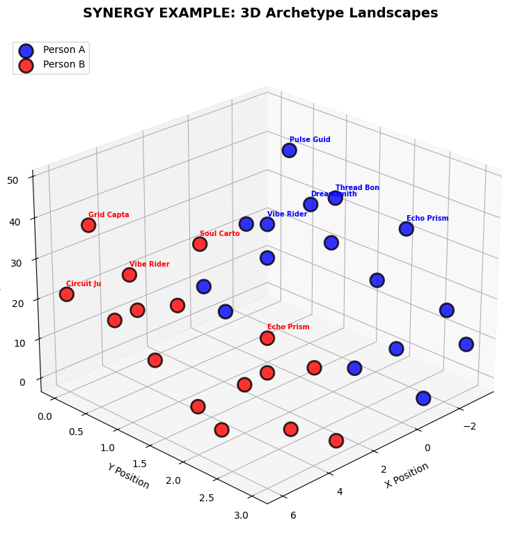

Note: This chart did not load correctly will fix later...

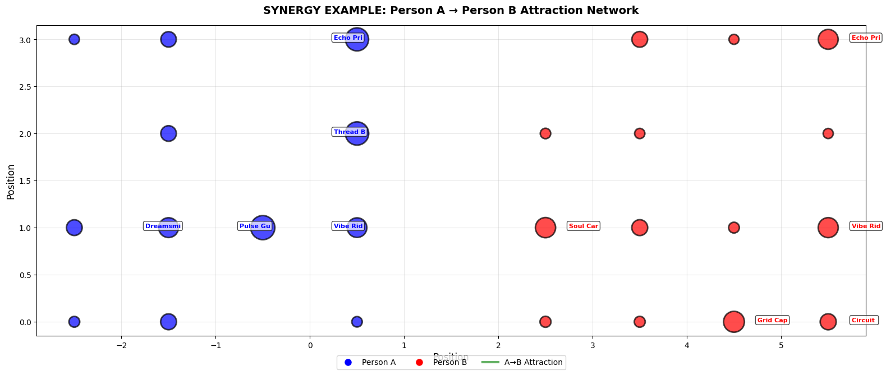
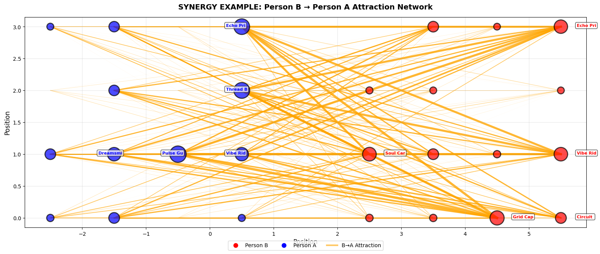

Top 5 A→B Attractions:
  Pulse Guide          → Grid Captain         (strength: 0.512, reverse: 0.456)
  Pulse Guide          → Soul Cartographer    (strength: 0.486, reverse: 0.421)
  Pulse Guide          → Vibe Rider           (strength: 0.480, reverse: 0.413)
  Pulse Guide          → Echo Prism           (strength: 0.474, reverse: 0.404)
  Thread Bonder        → Grid Captain         (strength: 0.470, reverse: 0.430)

Top 5 B→A Attractions:
  Grid Captain         → Pulse Guide          (strength: 0.456, reverse: 0.512)
  Grid Captain         → Thread Bonder        (strength: 0.430, reverse: 0.470)
  Grid Captain         → Echo Prism           (strength: 0.424, reverse: 0.460)
  Soul Cartographer    → Pulse Guide          (strength: 0.421, reverse: 0.486)
  Vibe Rider           → Pulse Guide          (strength: 0.413, reverse: 0.480)

======================================================================

PART 3: AGGREGATE CONNECTION ANALYSIS (MIXED PAIRS)

======================================================================

Analyzing aggregate patterns from 100 mixed pairs...
  Average A→B connection strength: 0.080
  Average B→A connection strength: 0.081
  Average synergy score: 938.247
  Total asymmetric pathways found: 2299689
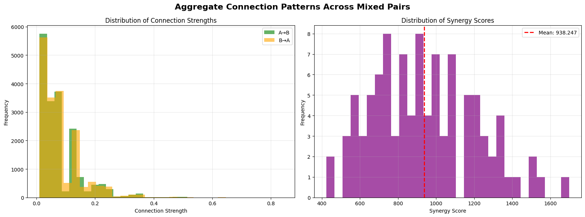

======================================================================

ANALYSIS COMPLETE!

======================================================================

 
======================================================================

MONTE CARLO SIMULATION WITH CONNECTION ANALYSIS

======================================================================

Recommended configurations:
  - Standard: 10000 users, 10 rounds, 20 simulations (2M events)
  - More rounds: 10000 users, 100 rounds, 20 simulations (20M events)
  - More users: 25000 users, 50 rounds, 20 simulations (25M events)
  - Maximum: 25000 users, 100 rounds, 20 simulations (50M events)

Enter number of users per simulation (e.g., 10000, 25000): 5000
Enter number of rounds per simulation (e.g., 10, 50, 100): 10
Enter number of simulations to run (e.g., 20): 20

======================================================================

Configuration:
  - Users per simulation: 5,000
  - Rounds per simulation: 10
  - Total simulations: 20
  - Total matching events: 1,000,000
  - Expected mixed pairs: ~400
 
======================================================================

Running 20 simulations with 5000 users...
  Completed 5/20 simulations...
  Completed 10/20 simulations...
  Completed 15/20 simulations...
  Completed 20/20 simulations...
Simulation complete! Found 817 mixed pairs.

======================================================================

PART 1: MONTE CARLO STATISTICAL RESULTS

======================================================================

Simulation Parameters:
  - Users per simulation: 5,000
  - Rounds per simulation: 10
  - Total simulations: 20
  - Total matching events: 1,000,000
  - Mixed pairs found: 817

Top 5 Most Selected Archetypes:
  Circuit Jumper      :  69245 selections (6.9%)
  Momentum Spark      :  69089 selections (6.9%)
  Grid Captain        :  68867 selections (6.9%)
  Core Mason          :  68011 selections (6.8%)
  Forge Handler       :  67729 selections (6.8%)

Rank Selection Distribution:
  Rank 1-3: 414651 (41.5%)
  Rank 4-8: 390724 (39.1%)
  Rank 9-16: 194625 (19.5%)

Match Type Distribution:
  same_persona        : 499183 (99.8%)
  mixed               :    817 (0.2%)

======================================================================

PART 2: CURATED SYNERGY EXAMPLE

======================================================================

Searching for high-synergy pair...
Found synergy pair (synergy score: 2450.773)
  Person A: Top archetype = Soul Cartographer
  Person B: Top archetype = Pulse Guide

Asymmetric Pathways Found:
  N/A | N/A: Gap A→B=-0.021, Gap B→A=0.021, Diagnostic=Direct Asymmetry
  N/A | N/A: Gap A→B=-0.020, Gap B→A=0.020, Diagnostic=Direct Asymmetry
  N/A | N/A: Gap A→B=-0.123, Gap B→A=0.123, Diagnostic=Direct Asymmetry
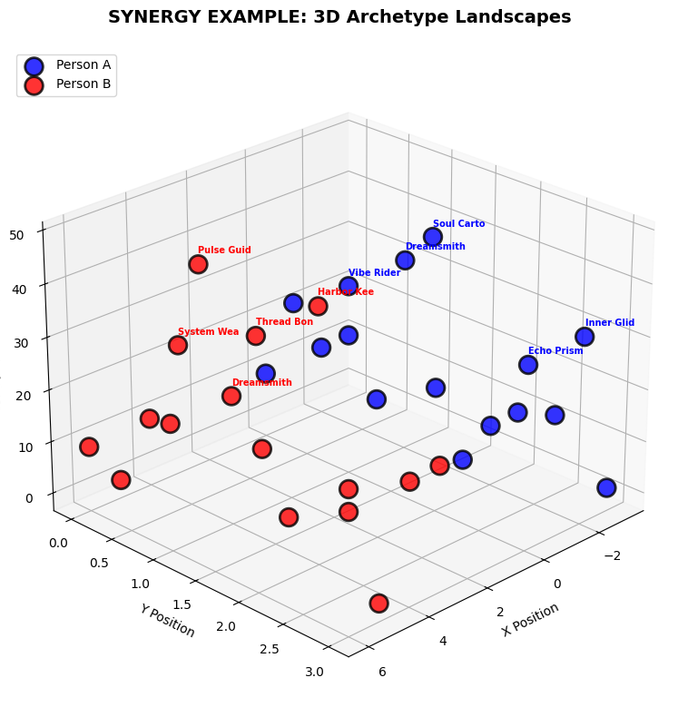

Note: This chart did not load correctly will fix later...

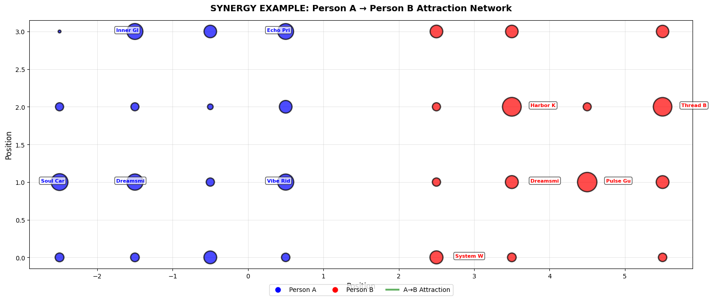
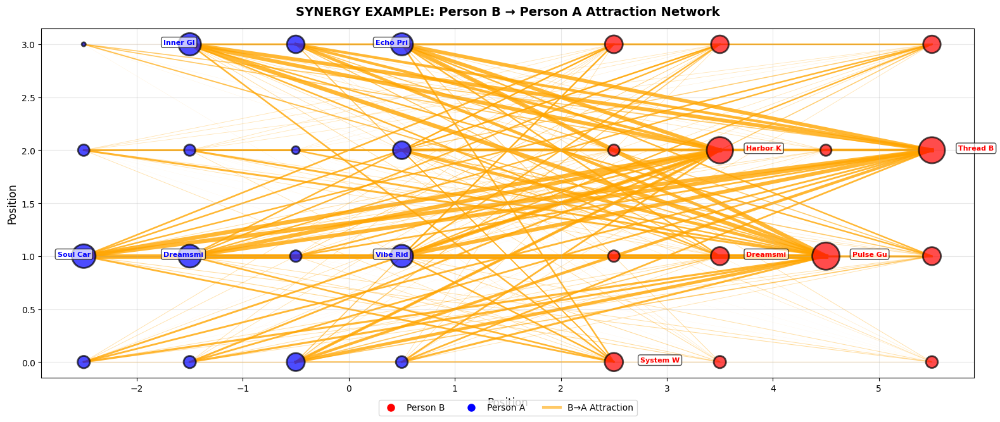

Top 5 A→B Attractions:
  Soul Cartographer    → Pulse Guide          (strength: 0.456, reverse: 0.512)
  Soul Cartographer    → Harbor Keeper        (strength: 0.430, reverse: 0.470)
  Soul Cartographer    → Thread Bonder        (strength: 0.424, reverse: 0.460)
  Dreamsmith           → Pulse Guide          (strength: 0.421, reverse: 0.486)
  Vibe Rider           → Pulse Guide          (strength: 0.413, reverse: 0.480)

Top 5 B→A Attractions:
  Pulse Guide          → Soul Cartographer    (strength: 0.512, reverse: 0.456)
  Pulse Guide          → Dreamsmith           (strength: 0.486, reverse: 0.421)
  Pulse Guide          → Vibe Rider           (strength: 0.480, reverse: 0.413)
  Pulse Guide          → Inner Glider         (strength: 0.474, reverse: 0.404)
  Harbor Keeper        → Soul Cartographer    (strength: 0.470, reverse: 0.430)

======================================================================

PART 3: AGGREGATE CONNECTION ANALYSIS (MIXED PAIRS)

======================================================================

Analyzing aggregate patterns from 100 mixed pairs...
  Average A→B connection strength: 0.082
  Average B→A connection strength: 0.083
  Average synergy score: 939.216
  Total asymmetric pathways found: 2251419
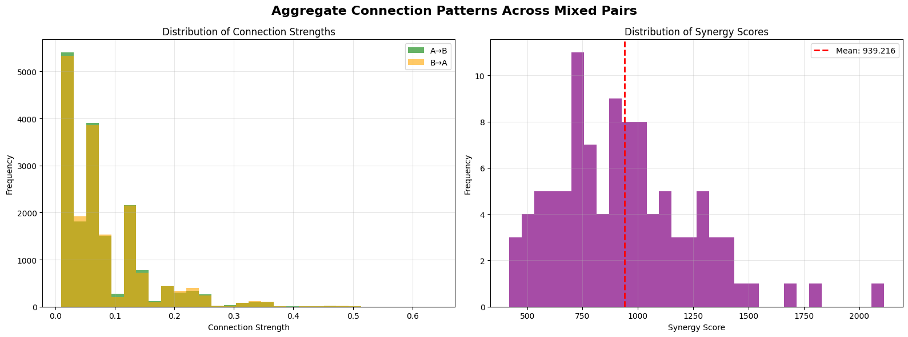

======================================================================

ANALYSIS COMPLETE!

======================================================================

 
======================================================================

MONTE CARLO SIMULATION WITH CONNECTION ANALYSIS

======================================================================

Recommended configurations:
  - Standard: 10000 users, 10 rounds, 20 simulations (2M events)
  - More rounds: 10000 users, 100 rounds, 20 simulations (20M events)
  - More users: 25000 users, 50 rounds, 20 simulations (25M events)
  - Maximum: 25000 users, 100 rounds, 20 simulations (50M events)

Enter number of users per simulation (e.g., 10000, 25000): 5000
Enter number of rounds per simulation (e.g., 10, 50, 100): 75
Enter number of simulations to run (e.g., 20): 20

======================================================================

Configuration:
  - Users per simulation: 5,000
  - Rounds per simulation: 75
  - Total simulations: 20
  - Total matching events: 7,500,000
  - Expected mixed pairs: ~3000
 
======================================================================

Running 20 simulations with 5000 users...
  Completed 5/20 simulations...
  Completed 10/20 simulations...
  Completed 15/20 simulations...
  Completed 20/20 simulations...
Simulation complete! Found 5952 mixed pairs.

======================================================================

PART 1: MONTE CARLO STATISTICAL RESULTS

======================================================================

Simulation Parameters:
  - Users per simulation: 5,000
  - Rounds per simulation: 75
  - Total simulations: 20
  - Total matching events: 7,500,000
  - Mixed pairs found: 5,952

Top 5 Most Selected Archetypes:
  Grid Captain        : 521117 selections (6.9%)
  Momentum Spark      : 520323 selections (6.9%)
  Circuit Jumper      : 517869 selections (6.9%)
  Core Mason          : 512163 selections (6.8%)
  Forge Handler       : 508318 selections (6.8%)

Rank Selection Distribution:
  Rank 1-3: 3111363 (41.5%)
  Rank 4-8: 2930335 (39.1%)
  Rank 9-16: 1458302 (19.4%)

Match Type Distribution:
  same_persona        : 3744048 (99.8%)
  mixed               :   5952 (0.2%)

======================================================================

PART 2: CURATED SYNERGY EXAMPLE

======================================================================

Searching for high-synergy pair...
Found synergy pair (synergy score: 2066.875)
  Person A: Top archetype = Pulse Guide
  Person B: Top archetype = System Weaver

Asymmetric Pathways Found:
  N/A | N/A: Gap A→B=-0.067, Gap B→A=0.067, Diagnostic=Direct Asymmetry
  N/A | N/A: Gap A→B=-0.057, Gap B→A=0.057, Diagnostic=Direct Asymmetry
  N/A | N/A: Gap A→B=-0.021, Gap B→A=0.021, Diagnostic=Direct Asymmetry
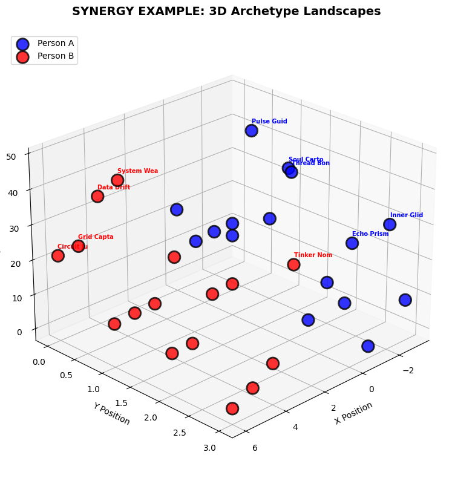

Note: This chart did not load correctly will fix later...

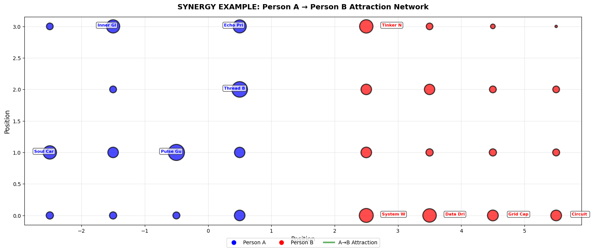
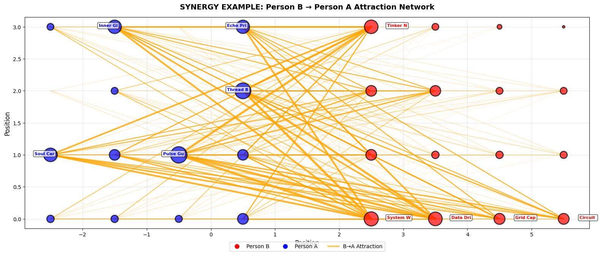

Top 5 A→B Attractions:
  Pulse Guide          → System Weaver        (strength: 0.512, reverse: 0.456)
  Pulse Guide          → Data Drifter         (strength: 0.486, reverse: 0.421)
  Pulse Guide          → Tinker Nomad         (strength: 0.480, reverse: 0.413)
  Thread Bonder        → System Weaver        (strength: 0.470, reverse: 0.430)
  Thread Bonder        → Data Drifter         (strength: 0.446, reverse: 0.397)

Top 5 B→A Attractions:
  System Weaver        → Pulse Guide          (strength: 0.456, reverse: 0.512)
  System Weaver        → Thread Bonder        (strength: 0.430, reverse: 0.470)
  Data Drifter         → Pulse Guide          (strength: 0.421, reverse: 0.486)
  Tinker Nomad         → Pulse Guide          (strength: 0.413, reverse: 0.480)
  Data Drifter         → Thread Bonder        (strength: 0.397, reverse: 0.446)

======================================================================

PART 3: AGGREGATE CONNECTION ANALYSIS (MIXED PAIRS)

======================================================================

Analyzing aggregate patterns from 100 mixed pairs...
  Average A→B connection strength: 0.079
  Average B→A connection strength: 0.080
  Average synergy score: 879.351
  Total asymmetric pathways found: 2159391
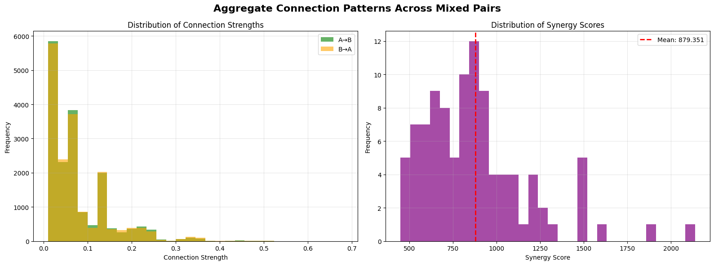

======================================================================

ANALYSIS COMPLETE!

======================================================================

 
======================================================================

MONTE CARLO SIMULATION WITH CONNECTION ANALYSIS

======================================================================

Recommended configurations:
  - Standard: 10000 users, 10 rounds, 20 simulations (2M events)
  - More rounds: 10000 users, 100 rounds, 20 simulations (20M events)
  - More users: 25000 users, 50 rounds, 20 simulations (25M events)
  - Maximum: 25000 users, 100 rounds, 20 simulations (50M events)

Enter number of users per simulation (e.g., 10000, 25000): 10000
Enter number of rounds per simulation (e.g., 10, 50, 100): 10
Enter number of simulations to run (e.g., 20): 20

======================================================================

Configuration:
  - Users per simulation: 10,000
  - Rounds per simulation: 10
  - Total simulations: 20
  - Total matching events: 2,000,000
  - Expected mixed pairs: ~800
 
======================================================================

Running 20 simulations with 10000 users...
  Completed 5/20 simulations...
  Completed 10/20 simulations...
  Completed 15/20 simulations...
  Completed 20/20 simulations...
Simulation complete! Found 800 mixed pairs.

======================================================================

PART 1: MONTE CARLO STATISTICAL RESULTS

======================================================================

Simulation Parameters:
  - Users per simulation: 10,000
  - Rounds per simulation: 10
  - Total simulations: 20
  - Total matching events: 2,000,000
  - Mixed pairs found: 800

Top 5 Most Selected Archetypes:
  Grid Captain        : 139725 selections (7.0%)
  Momentum Spark      : 138829 selections (6.9%)
  Circuit Jumper      : 138062 selections (6.9%)
  Core Mason          : 136466 selections (6.8%)
  Forge Handler       : 135988 selections (6.8%)

Rank Selection Distribution:
  Rank 1-3: 829792 (41.5%)
  Rank 4-8: 782974 (39.1%)
  Rank 9-16: 387234 (19.4%)

Match Type Distribution:
  same_persona        : 999200 (99.9%)
  mixed               :    800 (0.1%)

======================================================================

PART 2: CURATED SYNERGY EXAMPLE

======================================================================

Searching for high-synergy pair...
Found synergy pair (synergy score: 2069.654)
  Person A: Top archetype = Vibe Rider
  Person B: Top archetype = Vibe Rider

Asymmetric Pathways Found:
  N/A | N/A: Gap A→B=-0.019, Gap B→A=0.019, Diagnostic=Direct Asymmetry
  N/A | N/A: Gap A→B=-0.018, Gap B→A=0.018, Diagnostic=Direct Asymmetry
  N/A | N/A: Gap A→B=-0.057, Gap B→A=0.057, Diagnostic=Direct Asymmetry
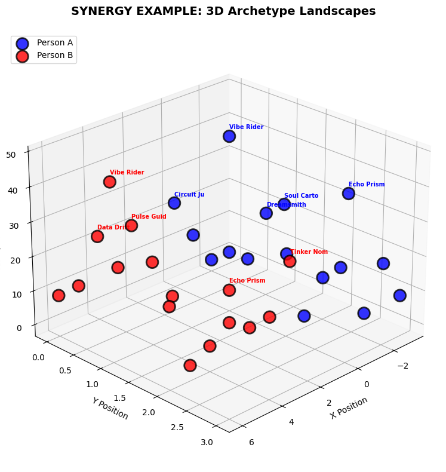

Note: This chart did not load correctly will fix later...

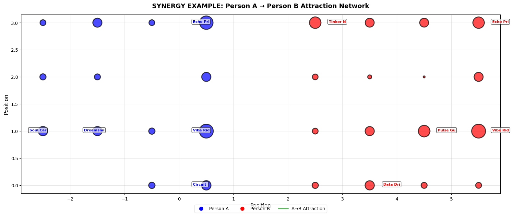
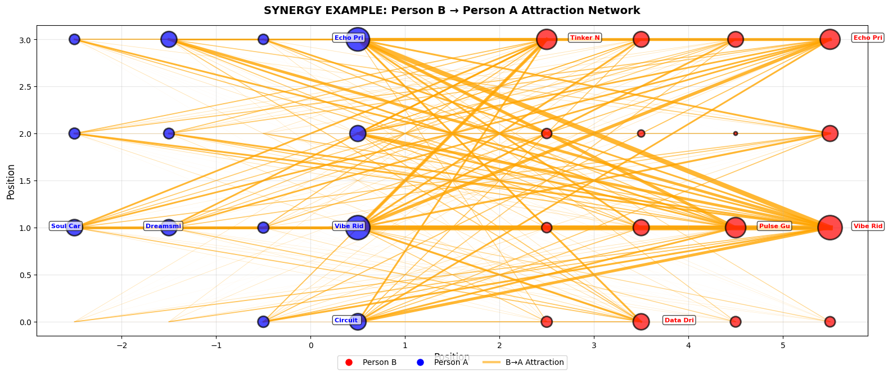

Top 5 A→B Attractions:
  Vibe Rider           → Vibe Rider           (strength: 0.640, reverse: 0.640)
  Echo Prism           → Vibe Rider           (strength: 0.589, reverse: 0.606)
  Vibe Rider           → Pulse Guide          (strength: 0.486, reverse: 0.421)
  Vibe Rider           → Tinker Nomad         (strength: 0.480, reverse: 0.413)
  Vibe Rider           → Echo Prism           (strength: 0.474, reverse: 0.404)

Top 5 B→A Attractions:
  Vibe Rider           → Vibe Rider           (strength: 0.640, reverse: 0.640)
  Vibe Rider           → Echo Prism           (strength: 0.606, reverse: 0.589)
  Pulse Guide          → Vibe Rider           (strength: 0.421, reverse: 0.486)
  Tinker Nomad         → Vibe Rider           (strength: 0.413, reverse: 0.480)
  Echo Prism           → Vibe Rider           (strength: 0.404, reverse: 0.474)

======================================================================

PART 3: AGGREGATE CONNECTION ANALYSIS (MIXED PAIRS)

======================================================================

Analyzing aggregate patterns from 100 mixed pairs...
  Average A→B connection strength: 0.083
  Average B→A connection strength: 0.082
  Average synergy score: 888.499
  Total asymmetric pathways found: 2109238
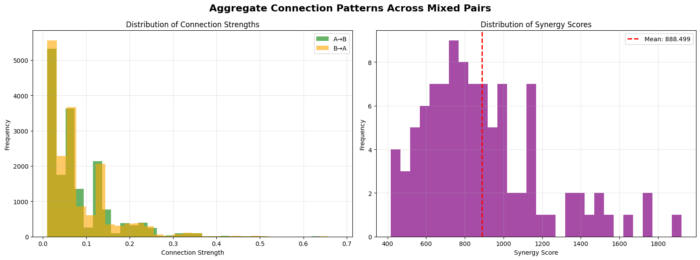

======================================================================

ANALYSIS COMPLETE!

======================================================================

 
======================================================================

MONTE CARLO SIMULATION WITH CONNECTION ANALYSIS

======================================================================

Recommended configurations:
  - Standard: 10000 users, 10 rounds, 20 simulations (2M events)
  - More rounds: 10000 users, 100 rounds, 20 simulations (20M events)
  - More users: 25000 users, 50 rounds, 20 simulations (25M events)
  - Maximum: 25000 users, 100 rounds, 20 simulations (50M events)

Enter number of users per simulation (e.g., 10000, 25000): 25000
Enter number of rounds per simulation (e.g., 10, 50, 100): 10
Enter number of simulations to run (e.g., 20): 20

======================================================================

Configuration:
  - Users per simulation: 25,000
  - Rounds per simulation: 10
  - Total simulations: 20
  - Total matching events: 5,000,000
  - Expected mixed pairs: ~2000
 
======================================================================

Running 20 simulations with 25000 users...
  Completed 5/20 simulations...
  Completed 10/20 simulations...
  Completed 15/20 simulations...
  Completed 20/20 simulations...
Simulation complete! Found 801 mixed pairs.

======================================================================

PART 1: MONTE CARLO STATISTICAL RESULTS

======================================================================

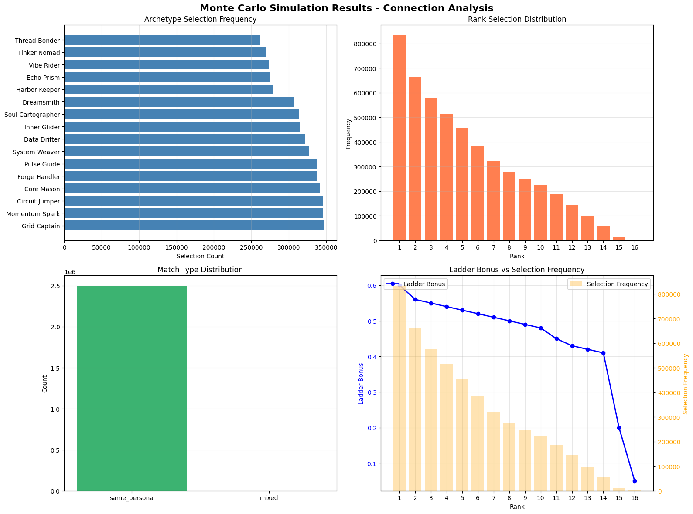

Simulation Parameters:
  - Users per simulation: 25,000
  - Rounds per simulation: 10
  - Total simulations: 20
  - Total matching events: 5,000,000
  - Mixed pairs found: 801

Top 5 Most Selected Archetypes:
  Grid Captain        : 346746 selections (6.9%)
  Momentum Spark      : 345918 selections (6.9%)
  Circuit Jumper      : 345180 selections (6.9%)
  Core Mason          : 341480 selections (6.8%)
  Forge Handler       : 338545 selections (6.8%)

Rank Selection Distribution:
  Rank 1-3: 2073019 (41.5%)
  Rank 4-8: 1952928 (39.1%)
  Rank 9-16: 974053 (19.5%)

Match Type Distribution:
  same_persona        : 2499199 (100.0%)
  mixed               :    801 (0.0%)

======================================================================

PART 2: CURATED SYNERGY EXAMPLE

======================================================================

Searching for high-synergy pair...
Found synergy pair (synergy score: 2053.900)
  Person A: Top archetype = System Weaver
  Person B: Top archetype = Soul Cartographer

Asymmetric Pathways Found:
  N/A | N/A: Gap A→B=0.122, Gap B→A=-0.122, Diagnostic=Direct Asymmetry
  N/A | N/A: Gap A→B=0.122, Gap B→A=-0.122, Diagnostic=Direct Asymmetry
  N/A | N/A: Gap A→B=0.128, Gap B→A=-0.128, Diagnostic=Direct Asymmetry
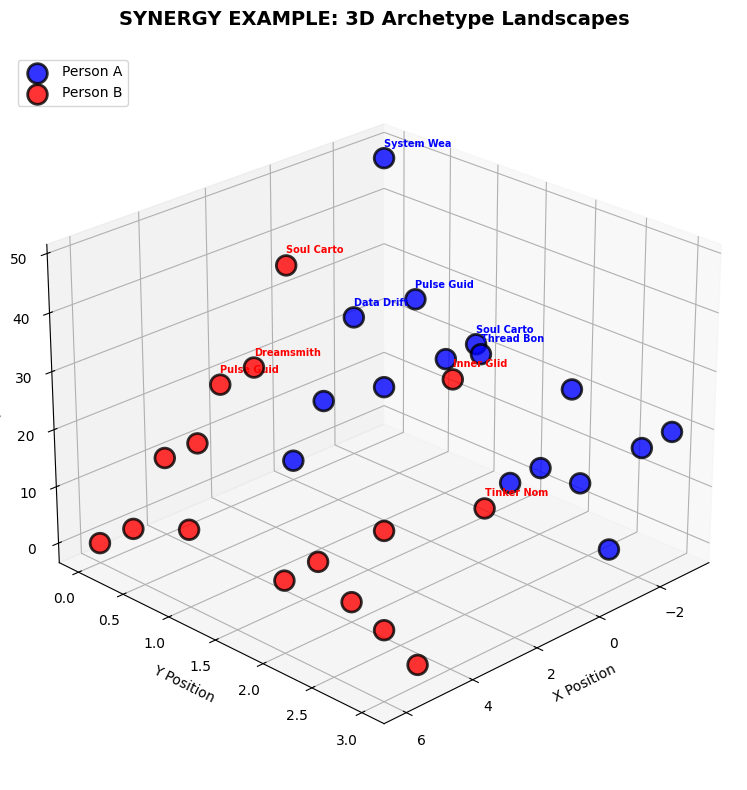

Note: This chart did not load correctly will fix later...

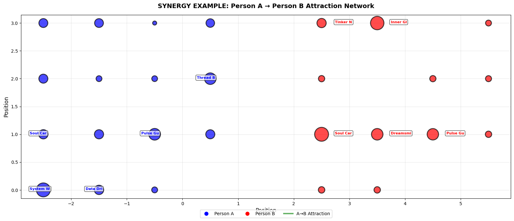
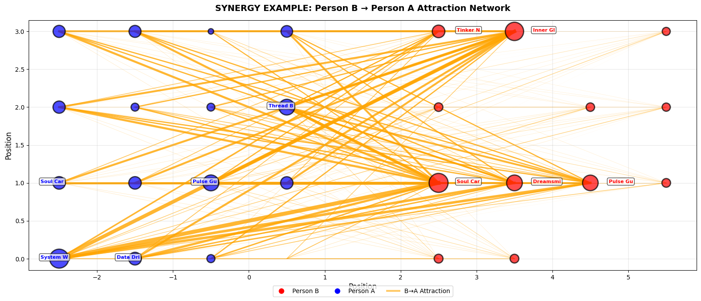

Top 5 A→B Attractions:
  System Weaver        → Soul Cartographer    (strength: 0.640, reverse: 0.640)
  System Weaver        → Inner Glider         (strength: 0.606, reverse: 0.589)
  System Weaver        → Dreamsmith           (strength: 0.480, reverse: 0.413)
  System Weaver        → Pulse Guide          (strength: 0.474, reverse: 0.404)
  Pulse Guide          → Soul Cartographer    (strength: 0.421, reverse: 0.486)

Top 5 B→A Attractions:
  Soul Cartographer    → System Weaver        (strength: 0.640, reverse: 0.640)
  Inner Glider         → System Weaver        (strength: 0.589, reverse: 0.606)
  Soul Cartographer    → Pulse Guide          (strength: 0.486, reverse: 0.421)
  Soul Cartographer    → Thread Bonder        (strength: 0.480, reverse: 0.413)
  Inner Glider         → Pulse Guide          (strength: 0.446, reverse: 0.397)

======================================================================

PART 3: AGGREGATE CONNECTION ANALYSIS (MIXED PAIRS)

======================================================================

Analyzing aggregate patterns from 100 mixed pairs...
  Average A→B connection strength: 0.084
  Average B→A connection strength: 0.080
  Average synergy score: 962.169
  Total asymmetric pathways found: 2278621
 
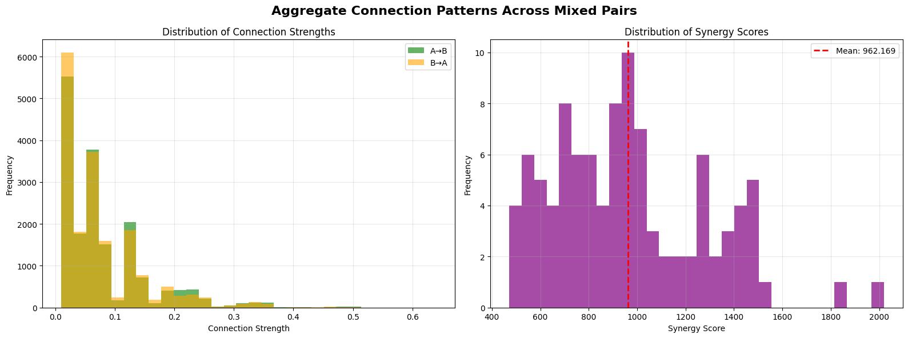

=========================================================

ANALYSIS COMPLETE!

=========================================================

