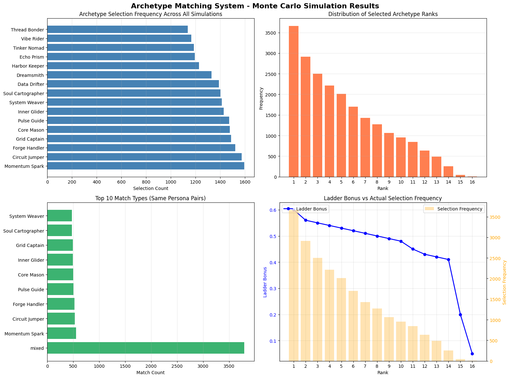
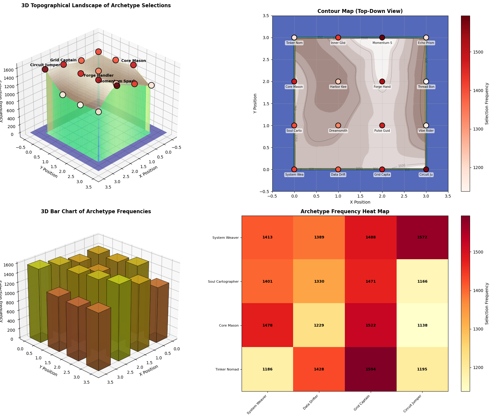
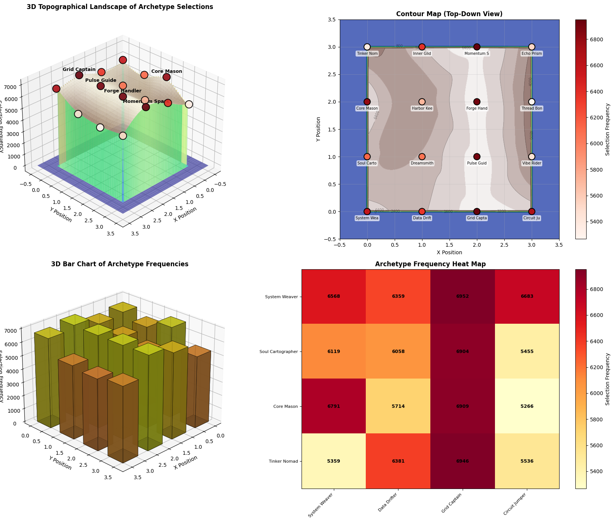
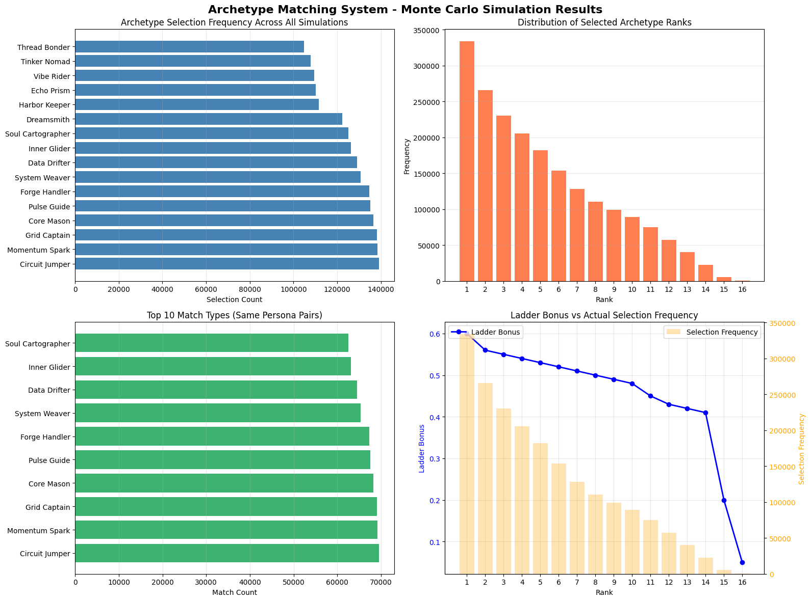
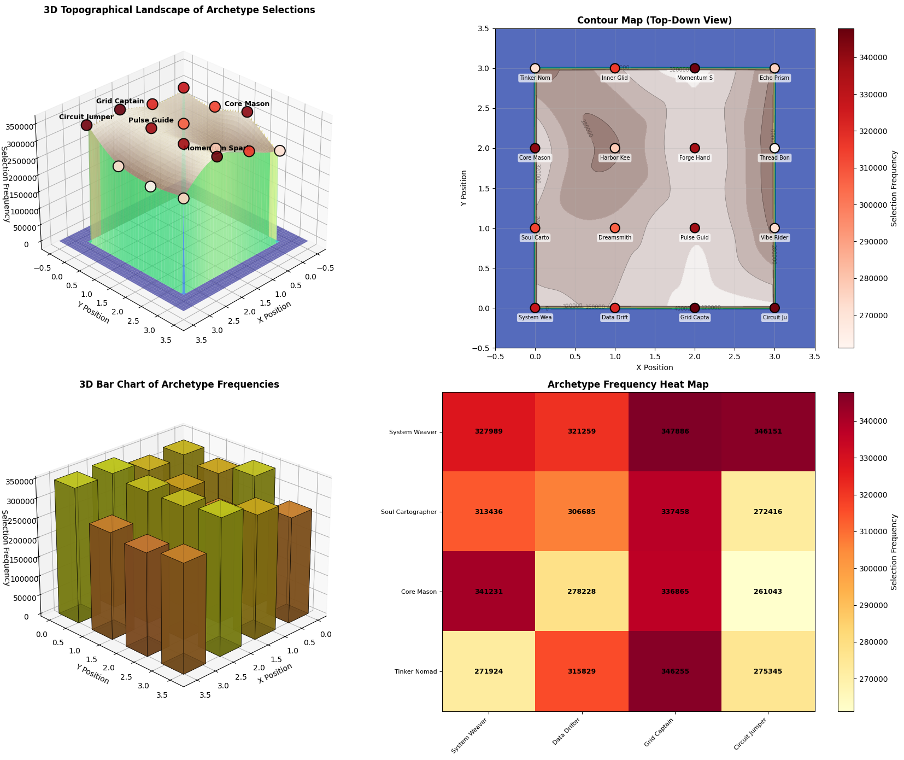

=========================================================

ARCHETYPE MATCHING SYSTEM - MONTE CARLO SIMULATION (with 3D Visualization)

=========================================================

Recommended configurations:
  - Quick test: 500 users, 10 rounds, 20 simulations (100K events)
  - Standard: 5000 users, 10 rounds, 20 simulations (1M events)
  - Large scale: 10000 users, 10 rounds, 20 simulations (2M events)

Enter number of users per simulation (e.g., 500, 5000, 10000): 22
Enter number of rounds per simulation (e.g., 10): 10
Enter number of simulations to run (e.g., 20, 100): 100

======================================================================

Running simulation with:
  - Users per simulation: 22
  - Interests per user: 5 (randomly selected from 52)
  - Rounds per simulation: 10
  - Total simulations: 100
  - Total matching events: 22,000

======================================================================

Generating completely random users with random interest selections...
Running simulation...

Simulation complete! Generating visualizations...

Creating 3D Topographical Map...

=========================================================

SUMMARY STATISTICS

=========================================================

Simulation Parameters:
  - Users per simulation: 22
  - Rounds per simulation: 10
  - Total simulations: 100
  - Total matching events: 22,000

Top 5 Most Selected Archetypes:
  Momentum Spark      :  1594 selections (7.2%)
  Circuit Jumper      :  1572 selections (7.1%)
  Forge Handler       :  1522 selections (6.9%)
  Grid Captain        :  1488 selections (6.8%)
  Core Mason          :  1478 selections (6.7%)

Rank Selection Distribution:
  Rank 1-3:   9080 (41.3%)
  Rank 4-8:   8629 (39.2%)
  Rank 9-16:  4291 (19.5%)

This demonstrates emergent patterns (alpha) from your matching system!

=========================================================

=========================================================

ARCHETYPE MATCHING SYSTEM - MONTE CARLO SIMULATION (with 3D Visualization)

=========================================================

Recommended configurations:
  - Quick test: 500 users, 10 rounds, 20 simulations (100K events)
  - Standard: 5000 users, 10 rounds, 20 simulations (1M events)
  - Large scale: 10000 users, 10 rounds, 20 simulations (2M events)

Enter number of users per simulation (e.g., 500, 5000, 10000): 500
Enter number of rounds per simulation (e.g., 10): 10
Enter number of simulations to run (e.g., 20, 100): 20

======================================================================

Running simulation with:
  - Users per simulation: 500
  - Interests per user: 5 (randomly selected from 52)
  - Rounds per simulation: 10
  - Total simulations: 20
  - Total matching events: 100,000

======================================================================

Generating completely random users with random interest selections...
Running simulation...

Simulation complete! Generating visualizations...

Creating 3D Topographical Map...

=========================================================

SUMMARY STATISTICS

=========================================================

Simulation Parameters:
  - Users per simulation: 500
  - Rounds per simulation: 10
  - Total simulations: 20
  - Total matching events: 100,000

Top 5 Most Selected Archetypes:
  Grid Captain        :  6952 selections (7.0%)
  Momentum Spark      :  6946 selections (6.9%)
  Forge Handler       :  6909 selections (6.9%)
  Pulse Guide         :  6904 selections (6.9%)
  Core Mason          :  6791 selections (6.8%)

Rank Selection Distribution:
  Rank 1-3:  41391 (41.4%)
  Rank 4-8:  39133 (39.1%)
  Rank 9-16: 19476 (19.5%)

This demonstrates emergent patterns (alpha) from your matching system!

=========================================================

=========================================================

ARCHETYPE MATCHING SYSTEM - MONTE CARLO SIMULATION (with 3D Visualization)

=========================================================

Recommended configurations:
  - Quick test: 500 users, 10 rounds, 20 simulations (100K events)
  - Standard: 5000 users, 10 rounds, 20 simulations (1M events)
  - Large scale: 10000 users, 10 rounds, 20 simulations (2M events)

Enter number of users per simulation (e.g., 500, 5000, 10000): 5000
Enter number of rounds per simulation (e.g., 10): 10
Enter number of simulations to run (e.g., 20, 100): 20

======================================================================

Running simulation with:
  - Users per simulation: 5,000
  - Interests per user: 5 (randomly selected from 52)
  - Rounds per simulation: 10
  - Total simulations: 20
  - Total matching events: 1,000,000

======================================================================

Generating completely random users with random interest selections...
Running simulation...

Simulation complete! Generating visualizations...

Creating 3D Topographical Map...

=========================================================

SUMMARY STATISTICS

=========================================================

Simulation Parameters:
  - Users per simulation: 5,000
  - Rounds per simulation: 10
  - Total simulations: 20
  - Total matching events: 1,000,000

Top 5 Most Selected Archetypes:
  Momentum Spark      : 69683 selections (7.0%)
  Grid Captain        : 69643 selections (7.0%)
  Circuit Jumper      : 69216 selections (6.9%)
  Forge Handler       : 68132 selections (6.8%)
  Core Mason          : 67860 selections (6.8%)

Rank Selection Distribution:
  Rank 1-3:  415075 (41.5%)
  Rank 4-8:  390686 (39.1%)
  Rank 9-16: 194239 (19.4%)

This demonstrates emergent patterns (alpha) from your matching system!

=========================================================

=========================================================

ARCHETYPE MATCHING SYSTEM - MONTE CARLO SIMULATION (with 3D Visualization)

=========================================================

Recommended configurations:
  - Quick test: 500 users, 10 rounds, 20 simulations (100K events)
  - Standard: 5000 users, 10 rounds, 20 simulations (1M events)
  - Large scale: 10000 users, 10 rounds, 20 simulations (2M events)

Enter number of users per simulation (e.g., 500, 5000, 10000): 10000
Enter number of rounds per simulation (e.g., 10): 10
Enter number of simulations to run (e.g., 20, 100): 20

======================================================================

Running simulation with:
  - Users per simulation: 10,000
  - Interests per user: 5 (randomly selected from 52)
  - Rounds per simulation: 10
  - Total simulations: 20
  - Total matching events: 2,000,000

======================================================================

Generating completely random users with random interest selections...
Running simulation...

Simulation complete! Generating visualizations...

Creating 3D Topographical Map...

=========================================================

SUMMARY STATISTICS

=========================================================

Simulation Parameters:
  - Users per simulation: 10,000
  - Rounds per simulation: 10
  - Total simulations: 20
  - Total matching events: 2,000,000

Top 5 Most Selected Archetypes:
  Circuit Jumper      : 139175 selections (7.0%)
  Momentum Spark      : 138550 selections (6.9%)
  Grid Captain        : 138132 selections (6.9%)
  Core Mason          : 136648 selections (6.8%)
  Pulse Guide         : 135115 selections (6.8%)

Rank Selection Distribution:
  Rank 1-3:  830366 (41.5%)
  Rank 4-8:  780848 (39.0%)
  Rank 9-16: 388786 (19.4%)

This demonstrates emergent patterns (alpha) from your matching system!

=========================================================

=========================================================

ARCHETYPE MATCHING SYSTEM - MONTE CARLO SIMULATION (with 3D Visualization)

=========================================================

Recommended configurations:
  - Quick test: 500 users, 10 rounds, 20 simulations (100K events)
  - Standard: 5000 users, 10 rounds, 20 simulations (1M events)
  - Large scale: 10000 users, 10 rounds, 20 simulations (2M events)

Enter number of users per simulation (e.g., 500, 5000, 10000): 25000
Enter number of rounds per simulation (e.g., 10): 10
Enter number of simulations to run (e.g., 20, 100): 20

======================================================================

Running simulation with:
  - Users per simulation: 25,000
  - Interests per user: 5 (randomly selected from 52)
  - Rounds per simulation: 10
  - Total simulations: 20
  - Total matching events: 5,000,000

======================================================================

Generating completely random users with random interest selections...
Running simulation...

Simulation complete! Generating visualizations...

Creating 3D Topographical Map...

=========================================================

SUMMARY STATISTICS

=========================================================

Simulation Parameters:
  - Users per simulation: 25,000
  - Rounds per simulation: 10
  - Total simulations: 20
  - Total matching events: 5,000,000

Top 5 Most Selected Archetypes:
  Grid Captain        : 347886 selections (7.0%)
  Momentum Spark      : 346255 selections (6.9%)
  Circuit Jumper      : 346151 selections (6.9%)
  Core Mason          : 341231 selections (6.8%)
  Pulse Guide         : 337458 selections (6.7%)

Rank Selection Distribution:
  Rank 1-3:  2071932 (41.4%)
  Rank 4-8:  1955132 (39.1%)
  Rank 9-16: 972936 (19.5%)

This demonstrates emergent patterns (alpha) from your matching system!

=========================================================
